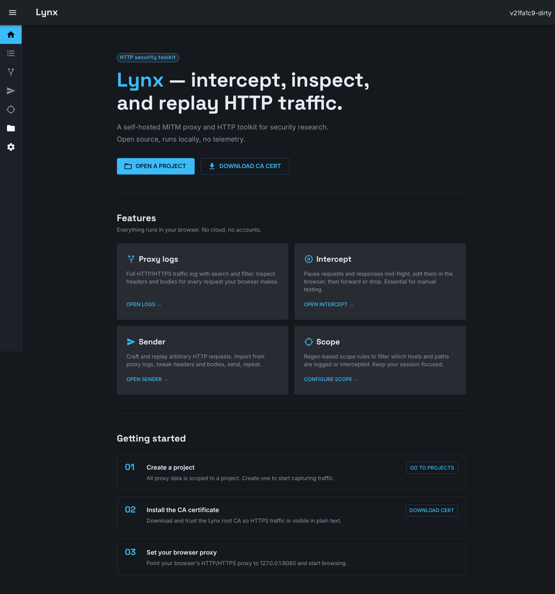

# Lynx

[](https://github.com/lorenzocamilli/lynx/actions/workflows/build-test.yml)
[](https://github.com/lorenzocamilli/lynx/actions/workflows/lint.yml)
[](https://github.com/lorenzocamilli/lynx/actions/workflows/codeql.yml)
[](https://github.com/lorenzocamilli/lynx/releases)
[](LICENSE)

**Lynx** is a self-hosted HTTP toolkit for security research: a
machine-in-the-middle (MITM) proxy, request interceptor, and request
replayer, all behind a single local web UI. An open source alternative to
commercial software like Burp Suite Pro, tailored to the needs of the
infosec and bug bounty community.

> Fork of [hetty](https://github.com/dstotijn/hetty) by David Stotijn. Lynx
> started as a rebrand and has since diverged with its own UI, auth/CSRF
> hardening, SSE-based live updates, and an ongoing security-hardening pass
> — see [`SECURITY.md`](SECURITY.md) for the full threat model.



## Features

- **Proxy logs** — full HTTP/HTTPS traffic log with search and filtering;
  inspect headers and bodies for every request your browser makes.
- **Intercept** — pause requests and responses mid-flight, edit them in the
  browser, then forward, drop, or (optionally) intercept the response too.
- **Sender** — craft and replay arbitrary HTTP requests; clone straight from
  a proxy log entry, tweak headers/body, resend.
- **Scope** — regex-based rules (URL, header key/value, body) to keep a
  session focused on the target and out-of-scope traffic unlogged.
- **Project-based** — all captured data is scoped to a project in a local
  BoltDB database; nothing leaves the machine.

## Install

Lynx isn't tagged for a release yet, so **build from source** is the only
supported install path today. Prebuilt binaries and a
`ghcr.io/lorenzocamilli/lynx` Docker image are wired up in CI
(see [`.goreleaser.yml`](.goreleaser.yml)) and will show up under
[Releases](https://github.com/lorenzocamilli/lynx/releases) once the first
tag ships.

### Prerequisites

- Go 1.25+ (`go.mod`'s directive; an older toolchain with network access
  will auto-fetch 1.25 via Go's toolchain mechanism)
- Node.js 20+ (for building the admin UI)

### Build

```bash
git clone https://github.com/lorenzocamilli/lynx.git
cd lynx
make build
```

This builds the Next.js admin UI, then compiles the Go binary at `./lynx`,
embedding the UI so the result is a single static binary. Plain
`go build ./cmd/lynx` (or `go install`) won't work on a fresh checkout — the
admin UI is a build artifact (`cmd/lynx/admin/`, produced by
`make build-admin`), not committed to the repo, and `//go:embed admin`
requires it to exist first.

## Quick start

```bash
./lynx
```

1. Open [http://127.0.0.1:8080](http://127.0.0.1:8080) — Lynx binds to
   localhost only by default.
2. Click **Download CA certificate** on the home page and trust it in your
   browser/OS, so Lynx can MITM HTTPS traffic.
3. Point your browser's HTTP/HTTPS proxy at `127.0.0.1:8080`.
4. Go to **Projects** and create one — all captured traffic is scoped to a
   project.

Runtime settings (port, host, log level, body-size cap, redacted headers)
live in `~/.lynx/config.yaml` and are editable at runtime from the Settings
page; most changes need a restart to take effect.

## Data storage & threat model

All data is stored under `~/.lynx/`:

| File | Purpose |
|------|---------|
| `~/.lynx/lynx_cert.pem` | CA certificate |
| `~/.lynx/lynx_key.pem` | CA private key |
| `~/.lynx/lynx.db` | BoltDB database (projects, logs, sender history) |
| `~/.lynx/config.yaml` | Application config |
| `~/.lynx/token` | Admin API bearer token (also printed to the console at startup) |

Captured traffic (headers and bodies) is stored in `lynx.db`
**unencrypted, by default verbatim** — this is deliberate: most pentest
workflows want a searchable, unredacted local record. Use the "Redact
headers" setting to mask specific headers (e.g. `Authorization`, `Cookie`)
before storage if that's not what you want.

Lynx binds to `127.0.0.1` by default and gates its API behind a per-install
bearer token plus Origin/CSRF checks — access control is fundamentally
"whoever can reach this port and read the token/console output." Don't bind
it to `0.0.0.0` on a shared or untrusted network without understanding that
tradeoff (the UI warns if you do). See [`SECURITY.md`](SECURITY.md) for the
complete threat model — including the CA private key's blast radius, the
admin-token flow, and known accepted risks.

## Development

```bash
make check                             # build, test, race-detect, vet, admin lint + typecheck
go test -tags noembed ./cmd/... ./pkg/... # Go tests only, no admin build required (avoid bare ./... — it walks into admin/node_modules)
go run ./cmd/lynx                      # run the real embedded build (needs `make build-admin` first)
```

See [`CONTRIBUTING.md`](CONTRIBUTING.md) for the full contribution workflow.

## License

MIT — see [`LICENSE`](LICENSE). Original copyright retained from
[hetty](https://github.com/dstotijn/hetty).
